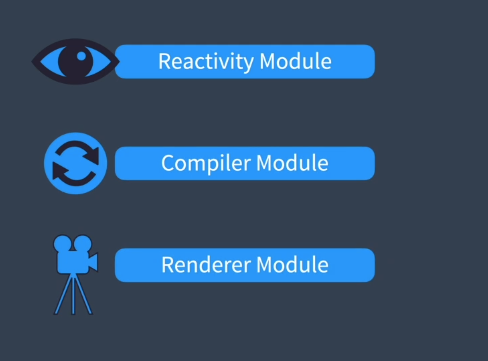
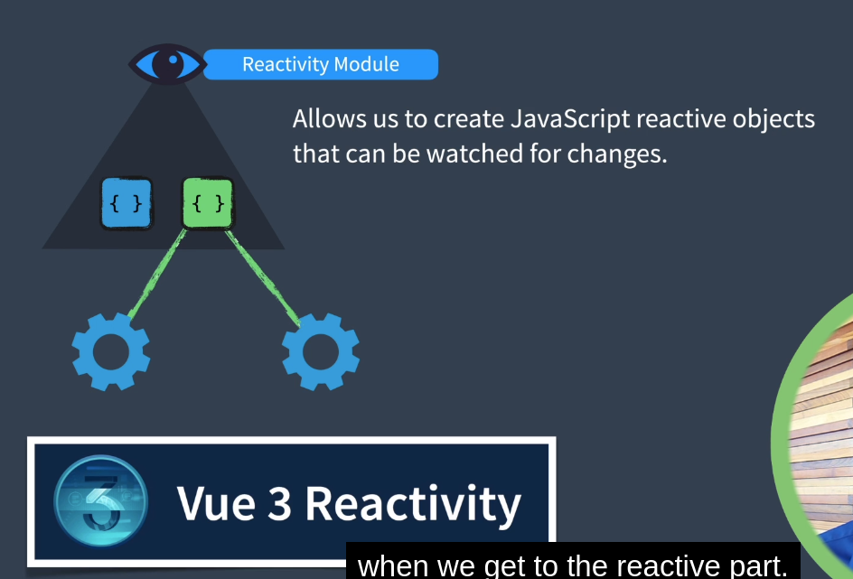

# Anatomia do Vue 3 aula 1

O mecanismo principal do Vue 3 é composto de várias partes.

### Módulo de Reatividade
Isso permite a criação de objetos reativos JavaScript que podem ser observados em busca de alterações. Quando o código que usa esses objetos é executado, eles são rastreados para serem executados posteriormente se o objeto reativo for alterado.

### Módulo Compilador
Ele sabe como pegar modelos HTML e compilá-los em funções de renderização. Isso pode acontecer no navegador em tempo de execução, mas acontece com mais frequência quando um projeto Vue é compilado, de modo que um navegador receba apenas funções de renderização.

### Módulo Renderizador
O renderizador contém o código para 3 fases diferentes de renderização de um componente em uma página da web.

#### Fases de Renderização
Quando a função render é chamada e retorna uma representação do DOM real chamada DOM Virtual. O Virtual DOM é uma representação de objeto JavaScript do que será renderizado no navegador.

* Fase de Montagem (ou Criação)
O renderizador pega o objeto Virtual DOM e faz chamadas reais de JavaScript do DOM para criar uma página da web.

* Fase de Patch (ou Atualização)
O renderizador pega os dois objetos Virtual DOM, um antigo e um novo, e atualiza apenas as partes da página da web que foram alteradas usando chamadas DOM JavaScript.

**Processo de um Componente Simples**
Vamos pensar em um componente simples com um template que utiliza um objeto reativo. Quando o Vue carrega:

1. O **Módulo Compilador** transforma o HTML em uma função de renderização.
2. Os objetos reativos são inicializados pelo **Módulo Reativo**.
3. A **Fase de Renderização do Módulo Renderer** invoca a função de renderização que cria um objeto Virtual DOM, ou VNode. Como nossa função de renderização faz referência a um objeto reativo, rastreamos que a função de renderização será executada novamente se o objeto reativo for alterado.
4. Na **Fase de Montagem**, a função **mount** é chamada, utilizando o VNode para criar a página web.
5. Quando o objeto reativo é alterado, a **Fase Patch** invoca a função de renderização novamente, e desta vez chama **patch** com o VNode antigo e o novo VNode, que atualiza apenas as partes da página que foram alteradas.
